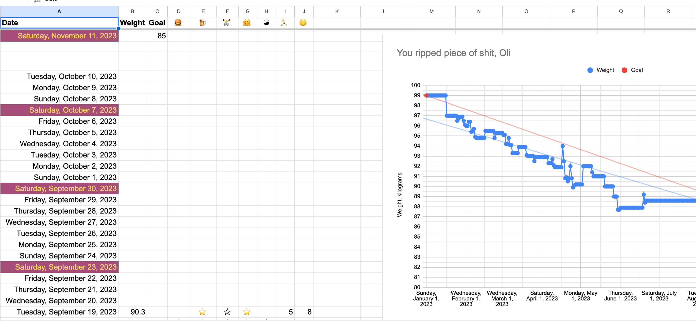

# Accountabilibuddes – bilibuddies.app

- Hosted on Digital Ocean + their managed Postgres instance
- Domain is registered through https://porkbun.com

### TODO

- Make the onboarding screen better:
  - Tells you what you have to fill in.
  - Redirects you to your activity page.

- Make activity pages always return the last 30 days, even if there is no
  data (it's probably easiest to do this in the listStats endpoint).

- Go through the PWA checklist and make sure this thing can be installed on a phone
  homescreen.

- Wait for Nameservers to be transferred to Digital Ocean, then set up the Google
  Oath application again + login from scratch.
  

## 😍Design

